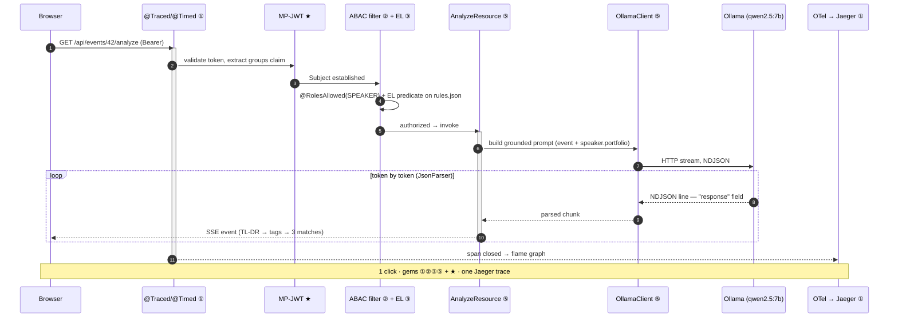
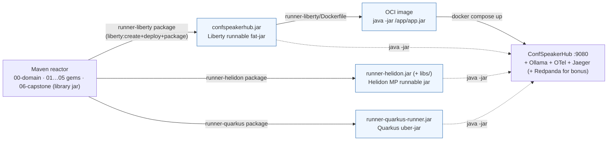

# ARCHITECTURE.md — ConfSpeakerHub

> The final architecture diagram for the capstone (post #6 / the talk's scene 6).
> Renders natively on GitHub.

Every numbered badge maps to a hidden gem:

| Badge | Gem | Spec |
|-------|-----|------|
| ① | Observability | Jakarta Interceptors |
| ② | Authorization | `@RolesAllowed` + JAX-RS ABAC filter |
| ③ | Policy & rules | Jakarta Expression Language (EL) |
| ④ | Reactive | Jakarta REST SSE + `@Asynchronous` |
| ⑤ | AI | Jakarta JSON-P (`JsonParser`) streaming |
| ★ | Auth | MicroProfile JWT |

---

## 1. Component & request-flow diagram

```mermaid
flowchart TB
    subgraph browser["🖥️  Browser — index.html (vanilla JS)"]
        UI["Dashboard + Analyze button<br/>EventSource('/api/events/stream')"]
    end

    subgraph jar["📦  runnable fat-jar — one per runtime (Open Liberty 26.0.0.5 default · Helidon MP 4.4.1 · Quarkus 3.36.1)"]
        direction TB

        TOKEN["DevTokenResource<br/>GET /api/dev/token  ★ mints MP-JWT"]

        subgraph crosscut["Cross-cutting (every request)"]
            direction LR
            TRACE["TracingInterceptor / TimingInterceptor<br/>@Traced @Timed  ①"]
            AUTHN["MP-JWT validation<br/>@LoginConfig(MP-JWT)  ★"]
            ABAC["AbacRequestFilter + @RolesAllowed  ②<br/>↓ delegates predicate eval<br/>ELPolicyEvaluator → SafeELEvaluator  ③"]
        end

        subgraph resources["JAX-RS resources"]
            direction TB
            EVENTS["EventsResource<br/>GET /api/events"]
            STREAM["EventStreamResource<br/>GET /api/events/stream  ④<br/>@Asynchronous + SseEventSink"]
            ANALYZE["AnalyzeResource<br/>GET /api/events/&#123;id&#125;/analyze  ⑤<br/>SSE out"]
        end

        BROAD["EventBroadcaster<br/>@ApplicationScoped · SseBroadcaster  ④"]
        STORE["InMemoryEventStore<br/>(seeded from feeds.json)"]
        OLLAMACLIENT["OllamaClient + PromptBuilder  ⑤<br/>JsonParser over NDJSON<br/>(StubAnalyzer fallback)"]
        POLICY[("policy/rules.json<br/>hot-reloaded via WatchService")]
    end

    subgraph sidecars["🐳  docker-compose sidecars"]
        direction TB
        OLLAMA["Ollama<br/>qwen2.5:7b"]
        OTELC["OTel Collector"]
        JAEGER["Jaeger UI :16686"]
        REDPANDA["Redpanda (Kafka)<br/>bonus-reactive-messaging only"]
    end

    %% auth handshake
    UI -- "1 · POST creds → Bearer token" --> TOKEN

    %% main read path
    UI -- "2 · GET /api/events (Bearer)" --> TRACE
    TRACE --> AUTHN --> ABAC
    ABAC -. "reads predicates" .-> POLICY
    ABAC --> EVENTS --> STORE

    %% live SSE path
    UI == "3 · SSE subscribe" ==> STREAM
    STREAM --> BROAD
    STORE -- "@Observes EventCachedEvent" --> BROAD
    BROAD == "4 · push new ConfEvent" ==> UI

    %% analyze path
    UI -- "5 · GET …/analyze (Bearer)" --> ANALYZE
    ANALYZE --> OLLAMACLIENT
    OLLAMACLIENT -- "NDJSON stream" --> OLLAMA
    ANALYZE == "6 · SSE tokens → 3 portfolio matches" ==> UI

    %% observability
    TRACE -. "OTLP spans" .-> OTELC --> JAEGER

    %% bonus messaging (dashed = not in capstone jar)
    EVENTS -. "bonus: ingest/audit" .-> REDPANDA

    classDef gem fill:#eef6ff,stroke:#2b6cb0,stroke-width:1px;
    classDef store fill:#fff7e6,stroke:#b7791f,stroke-width:1px;
    classDef bonus stroke-dasharray: 4 3,fill:#f5f5f5,stroke:#888;
    class TRACE,ABAC,STREAM,ANALYZE,BROAD,OLLAMACLIENT,AUTHN,TOKEN gem;
    class STORE,POLICY store;
    class REDPANDA bonus;
```

---

## 2. The "one click, five gems" trace (talk scene 6)

A single **GET `/api/events/{id}/analyze`** click lights up the whole stack — the
flame graph the capstone slide shows in Jaeger:

---

## 3. Deployment view

> One runtime-neutral application library (`06-capstone`), three runner modules
> under `06-capstone/runners/`, each producing a `java -jar` fat-jar and carrying
> its own multi-stage `Dockerfile` — **no WAR is a deliverable** (Liberty
> assembles a transient WAR internally):
>
> | Runner | Build | Artifact | Dockerfile |
> |--------|-------|----------|------------|
> | Liberty | `mvn -pl 06-capstone/runners/runner-liberty -am package` | `runner-liberty/target/confspeakerhub.jar` | `runner-liberty/Dockerfile` |
> | Helidon MP | `mvn -pl 06-capstone/runners/runner-helidon -am package` | `runner-helidon/target/runner-helidon.jar` (+ `libs/`) | `runner-helidon/Dockerfile` |
> | Quarkus | `mvn -pl 06-capstone/runners/runner-quarkus -am package` | `runner-quarkus/target/runner-quarkus-runner.jar` | `runner-quarkus/Dockerfile` |
>
> The Liberty runner resolves its kernel + features from **Maven Central**
> (`io.openliberty:openliberty-kernel`) rather than IBM's download host, so the
> build needs only one repository.
>
> The application code is identical across all three — MicroProfile JWT auth,
> JAX-RS, CDI, EL (Expressly bundled) and JSON-P. One portability seam worth
> noting: Helidon MP & Quarkus need the JAX-RS `Application` to be a CDI bean
> (`@ApplicationScoped`) to honor `@ApplicationPath`. The gem #2/#3 layering uses
> a globally-enabled CDI `@Alternative` + `@Priority` (the portable equivalent of
> `@Specializes`), which Weld and Quarkus Arc both honor natively — so no
> Quarkus-only veto is needed and the gem source is unchanged.

---

## 4. Portability matrix

Same WAR runs on any compliant runtime. Spec level, Liberty feature, and status:

| Gem | Spec (level) | Liberty feature | Portability |
|-----|--------------|-----------------|-------------|
| ① Observability | Interceptors 2.2 (CDI) | `cdi-4.1` | ✅ |
| ② Authorization | Security 4.0 / REST 4.0 | `appSecurity-6.0`, `restfulWS-4.0` | ✅ |
| ③ Policy & rules | EL 6.0 (Expressly in WAR) | bundled | ✅ |
| ④ Reactive (SSE) | REST 4.0 | `restfulWS-4.0` | ✅ |
| ④ Reactive (async) | Concurrency 3.1 | `concurrent-3.1` | ⚠️ see caveat |
| ⑤ AI streaming | JSON-P 2.1 | `jsonp-2.1` | ✅ |
| ★ Auth token | MP JWT 2.1 (MP 7.1) | `microProfile-7.1` | ✅ |

**`@Asynchronous` caveat:** it's Jakarta Concurrency 3.1
(`jakarta.enterprise.concurrent.Asynchronous`, Web Profile — not
`jakarta.ejb.Asynchronous`). The annotation only fires through the CDI proxy,
but `EventStreamResource.subscribe → this.sendSnapshotAsync` and
`AnalyzeResource.analyze → this.runAsync` are self-invocations that bypass it,
so the work runs inline on the request thread today. Functionally correct;
moving the worker to a separate injected bean is a tracked follow-up.

